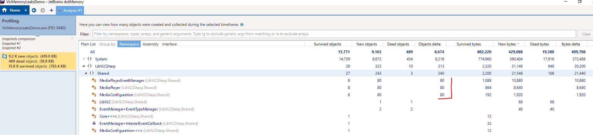

### LibVlcSharp memory leak demo

Here's an image of memory profiling app with .net Memory profiler (JetBrains) and leaked objects.

Every time LibVLCSharp.Shared.MediaPlayer is created and disposed, there is leak of theese three objects.